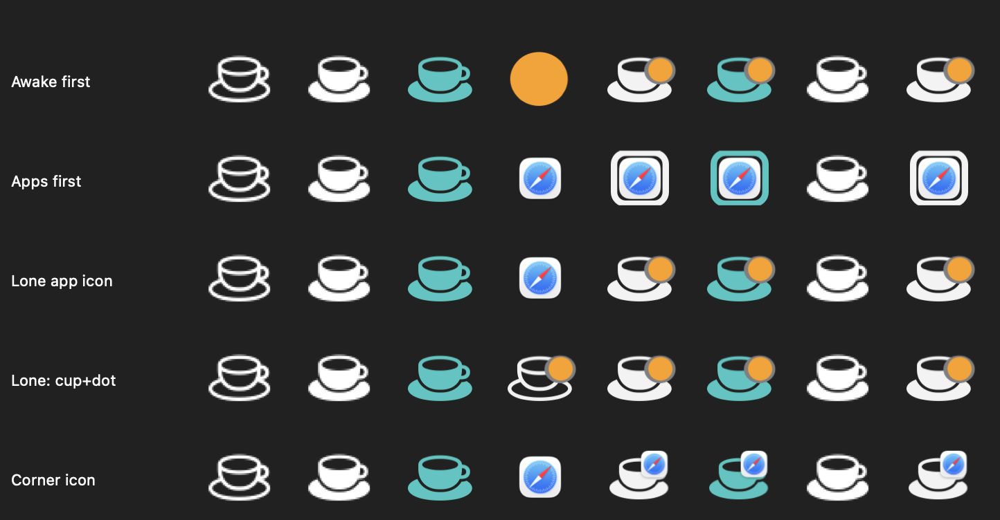

# Awake

A native macOS menu-bar app that shows **who is keeping your Mac awake** — and lets
you keep it awake yourself, with timed holds and a global hotkey. Instead of a single
on/off, it breaks down every power assertion by **owner** and lets you start/stop holds
natively.

Zero external dependencies — only Apple system frameworks (SwiftUI, AppKit,
IOKit, Carbon, ServiceManagement).

## What it shows

The dropdown groups every sleep-relevant power assertion into four buckets:

| Bucket | What it is |
|---|---|
| **This App** | Caffeination you started *here* (a native `IOPMAssertion`). |
| **You** | `caffeinate` *you* started — typed in a terminal. Shows the command (`caffeinate -i -t 300`), a live countdown, and the source (`CLI` / terminal name). |
| **Apps** | An app/tool keeping sleep open — including **tools that spawn `caffeinate` under the hood** (e.g. **Claude Code** → "Claude Code · via caffeinate"), plus apps holding native assertions (**Arc** WebRTC/audio, ChatGPT, Messages…). Apps that hold sleep "on behalf of" another (via `runningboardd`) are attributed to the real app. |
| **System** | OS plumbing — `powerd` (display-on), `WindowServer`, and background daemons (`mds_stores`, `dataaccessd`, `cloudd`…). Hidden by default; toggle in Settings. |

### How caffeinate attribution works

The `caffeinate` CLI is used by *you* (typed in a terminal) **and** by tools that
keep the Mac awake while they run — Claude Code, for instance, spawns
`caffeinate -i -t 300` and refreshes it every 5 minutes. To tell these apart,
Awake walks each `caffeinate` process's **parent/ancestor chain** (`sysctl` +
`proc_pidpath`) and credits the nearest meaningful originator:

- nearest non-shell ancestor is a **terminal emulator** (WezTerm, iTerm, Terminal…)
  or the process is shell/launchd-rooted → **You** (`CLI`) — you typed it
- nearest ancestor is **any other tool/app** (Claude Code, build scripts, Electron
  apps…) → **Apps**, labelled "*Tool* · via caffeinate"

Shells, `tmux`, `login`, `sudo`, etc. are treated as pass-through; generic
runtimes (`node`, `electron`…) are bridged up to the owning `.app`.

The **menu-bar icon** is composed from a **primary mark** plus an optional small
**top-right corner mark**, so you can always tell who is holding sleep open even when
both you and an app are:

- a **cup** stands for *your* hold — **filled** while you're holding (via Awake or a CLI
  `caffeinate`), **outline** when the Mac can sleep;
- a **colored dot** — or, optionally, the **real icon** of the app — stands for *another
  app* holding sleep.

When both you and an app hold at once, one is the primary mark and the other shrinks to
the corner. Which goes in front is your choice in **Settings → Appearance → Icon Style**:

| “Show in front” | You **and** an app | **Only** an app |
|---|---|---|
| **Awake** (default) | your cup is primary, the app rides in the corner | a cup with the app in the corner — or just the app, your pick |
| **other apps** | the app's icon is primary, your cup shrinks to a corner pip/ring | the app on its own |

Your own holds default to adaptive **template** glyphs that follow the menu bar's
light/dark appearance; the app mark uses the configurable **Apps** color (a dot) or the
app's real icon. When *This App* and *You (CLI)* both hold, the cup takes the *This App*
color.



*Columns: idle · this app · you · an app · this app + app · you + app · this app + you · all. Rows: the “Show in front” / lone-app / app-icon options.*

### Customizing the appearance

**Settings → Appearance** has two parts, each with a live preview of all eight holder
combinations:

- **Icon Style** — pick what goes *in front* when you and an app both hold (Awake's cup
  or the app), what to show when only an app holds, whether to use an app's real icon (as
  the main mark or just in the corner), and whether to mark who else is holding. A
  **Reset Icon Style** button restores the defaults.
- **Colors** — color wells for the four base colors (This App / You / Apps / Idle). The
  This App / You / Idle slots default to *adaptive* template glyphs that follow the
  menu-bar appearance; pick a custom color or revert. A **Reset Colors** button restores
  the shipped palette.

Everything persists in `UserDefaults` and the menu-bar glyph re-renders immediately.

Render the current settings' states to a PNG: `Awake.app/Contents/MacOS/Awake --icons /tmp/states.png`

## Controls

- **Toggle / timed holds**: 15m / 30m / 1h / 2h / 4h / 8h / custom / "until time" /
  indefinite, with a live countdown and a "+15 min" extend. Timed holds use a kernel
  auto-release timeout (`IOPMAssertion`), so the hold ends even if the app is killed.
- **Global hotkey** to toggle from anywhere — default **⌃⌥⌘A** — rebindable in Settings
  (Carbon `RegisterEventHotKey`; no Accessibility permission needed).
- **Stop Terminal Commands** — sends SIGTERM to the stray `caffeinate` processes
  you started in a terminal.
- **Launch at login** via `SMAppService` (toggle in Settings).
- **Categories** — manually override any holder's bucket (Settings → Categories);
  overrides persist and flow into the dropdown and the menu-bar icon.

## Install

Download the latest **Awake.app** from the
[Releases page](https://github.com/mackhaymond/Awake/releases), unzip, and open it.
Builds are ad-hoc signed (not notarized), so on first launch right-click → **Open**, or
run `xattr -dr com.apple.quarantine Awake.app`.

## Build & run

```sh
git clone https://github.com/mackhaymond/Awake.git
cd Awake
bash build.sh          # swift build -c release → assembles + ad-hoc-signs Awake.app
open Awake.app         # registers with LaunchServices; menu-bar icon appears
```

Requires the Swift 6 toolchain (Xcode 16+). macOS 14+ (`LSMinimumSystemVersion`); built/tested on macOS 26.

`build.sh` **ad-hoc signs** the app (no Developer ID, not notarized), which is fine for
running it on the Mac that built it. If you move the bundle to another Mac, macOS
Gatekeeper will flag it as from an unidentified developer — right-click → **Open** once,
or run `xattr -dr com.apple.quarantine Awake.app`. Building from source is the supported
path.

## Headless diagnostics

```sh
Awake.app/Contents/MacOS/Awake --dump            # print the classified buckets and exit
Awake.app/Contents/MacOS/Awake --selftest        # verify the caffeination lifecycle (create → detect → release)
Awake.app/Contents/MacOS/Awake --icons <path>    # render all icon states to a PNG
Awake.app/Contents/MacOS/Awake --appicon <dir>   # render an AppIcon.iconset (used by build.sh)
Awake.app/Contents/MacOS/Awake --help            # show usage
```

## Layout

```
Package.swift            executableTarget "Awake", no dependencies
build.sh                 builds + bundles + ad-hoc signs Awake.app
Info.plist               reference plist (build.sh generates the authoritative one)
Sources/Awake/
  AwakeApp.swift           @main entry (+ --dump/--selftest/--icons/--appicon/--help), MenuBarExtra + composed status icon + app delegate
  AwakeModel.swift         coordinator: caffeination, hotkey, login item, refresh timer
  AssertionReader.swift    reads assertions via IOKit (IOPMCopyAssertionsByProcess), pmset fallback
  AssertionClassifier.swift buckets holders + derives friendly reasons
  AppIdentityResolver.swift PID/bundle → friendly app name + icon
  CaffeinationController.swift native IOPMAssertion create/release + kill-stray-caffeinate
  HotKey.swift             Carbon global hotkey wrapper
  LoginItem.swift          SMAppService launch-at-login
  AppPreferences.swift     UserDefaults-backed settings
  Models.swift             value types (PowerAssertion, Bucket, AssertionRow, key combo…)
  MenuContentView.swift    the dropdown UI
  SettingsView.swift       tabbed settings (General / Appearance / Categories / Advanced / About)
  DebugDump.swift          --dump / --selftest implementations
```

## License

[MIT](LICENSE) © 2026 Mack Haymond.

The menu-bar and list glyphs are rendered at runtime from Apple **SF Symbols**, which
are provided by Apple and governed by the [Apple SF Symbols license](https://developer.apple.com/fonts/) —
they are not covered by this project's MIT license. The app icon is original artwork and
does not use an SF Symbol.

Third-party product and company names (Claude Code, Arc, ChatGPT, WezTerm, iTerm,
Ghostty, kitty, Ice, Bartender, …) are trademarks of their respective owners and are
referenced here only for identification and interoperability.
